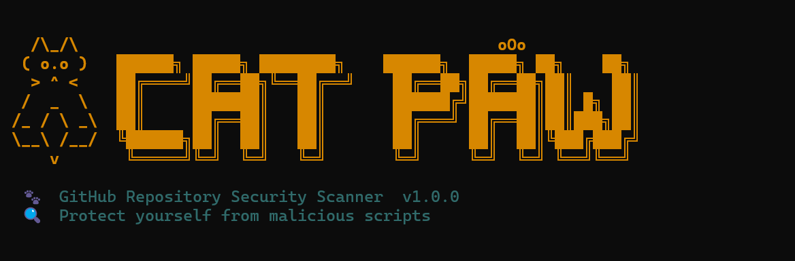
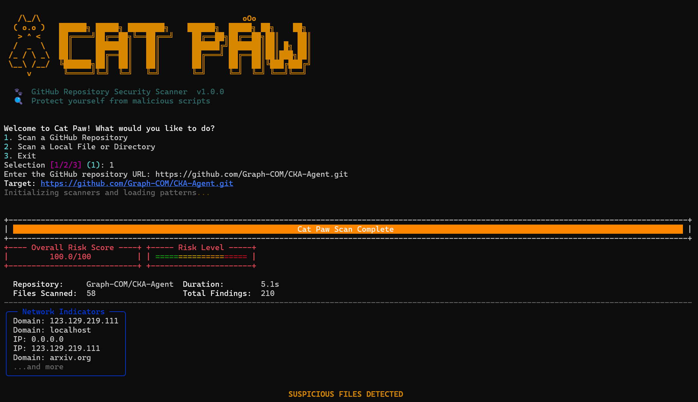

<div align="center">
  <pre>/\_/\                                            oOo
  ( o.o )   ██████╗ █████╗ ████████╗    ██████╗  █████╗ ██╗    ██╗
   > ^ <    ██╔════╝██╔══██╗╚══██╔══╝    ██╔══██╗██╔══██╗██║    ██║
  /  _  \   ██║     ███████║   ██║       ██████╔╝███████║██║ █╗ ██║
 /_ / \ _\  ██║     ██╔══██║   ██║       ██╔═══╝ ██╔══██║██║███╗██║
 \__\ /__/  ╚██████╗██║  ██║   ██║       ██║     ██║  ██║╚███╔███╔╝
     v       ╚═════╝╚═╝  ╚═╝   ╚═╝       ╚═╝     ╚═╝  ╚═╝ ╚══╝╚══╝ 
  </pre>
  
  <p><b>🐾 Advanced GitHub Repository Security Scanner 🐾</b></p>
  
  [](https://www.python.org/)
  [](LICENSE)
  [](https://github.com/)
  [](CONTRIBUTING.md)
  
</div>

---

**Cat Paw** is a powerful, lightning-fast terminal-based DevSecOps tool designed to protect you from malicious code, backdoors, and hidden payloads inside GitHub repositories. Before you `git clone` and run an untrusted script, let Cat Paw scan it.

<br>

<div align="center">
  <!-- PLACEHOLDER FOR TERMINAL INTERFACE SCREENSHOT -->
  
  <p><i>Cat Paw's Beautiful Interactive Terminal Interface</i></p>
</div>

## 🛡️ Why Cat Paw? (Day-to-Day Use)
Developers constantly download and execute code from GitHub. But how do you know a script won't silently steal your Discord tokens, encrypt your files, or start mining cryptocurrency? 
Reading every line of code in a large repository is impossible. **Cat Paw solves this by automating the code review process.** 

Whether you are testing an open-source tool, reviewing a pull request, or auditing a new library, Cat Paw gives you an instant, color-coded **0-100 Risk Score** and highlights exact lines of code that pose a threat.

## 🧠 How it Works (Algorithms & Accuracy)
Cat Paw achieves incredibly high accuracy and low false-positive rates by combining **5 specialized analysis engines** rather than relying on simple text searches:

1. **AST Parsing (Abstract Syntax Tree)**: Deeply understands code structure (specifically Python) to catch dangerous dynamic imports and nested obfuscation chains that regex completely misses.
2. **Shannon Entropy Algorithm**: Uses mathematical entropy calculations to detect highly randomized strings—a massive indicator of encrypted payloads and base64 obfuscation.
3. **Pattern Matching Matrix**: Over 150+ rigorously tested regex rules mapped directly to MITRE ATT&CK techniques, targeting Reverse Shells, Fork Bombs, and Credential Exfiltration.
4. **Behavioral Combination Engine**: It detects *context*. A `base64 decode` is a warning. But `base64 decode` + `exec()` + `socket` in the same file instantly triggers a **Critical** verdict.
5. **Permission & Network Auditing**: Automatically extracts hardcoded IP addresses, suspicious C2 ports, and flags covert microphone, camera, or clipboard access.

<br>

<div align="center">
  <!-- PLACEHOLDER FOR SCAN OUTPUT SCREENSHOT -->
  
  <p><i>Professional, Aggregated Suspicious Indicators Report</i></p>
</div>

---

## 🚀 Setup & Installation

Getting started with Cat Paw is incredibly simple. 

1. **Clone the repository**
   ```bash
   git clone https://github.com/yourusername/cat-pawn.git
   cd cat-pawn
   ```
2. **Install globally via pip**
   ```bash
   pip install -e .
   ```
   *(This instantly adds the `catpaw` command to your system PATH)*

## 💻 Usage & Commands

Cat Paw features a gorgeous interactive CLI powered by `Rich`.

### 1. Interactive Mode (Recommended)
Just type the tool name and press enter! Cat Paw will launch an interactive menu asking what you want to do and prompt you for the necessary links.
```bash
catpaw
```

### 2. Direct Repository Scan
Skip the prompts and directly scan any public GitHub repository. Cat Paw will automatically download the repo in memory and scan it.
```bash
catpaw scan https://github.com/username/repo
```

### 3. Direct Local Scan
Scan a folder or script already on your machine.
```bash
catpaw local ./my-project-folder
```

### Options & Flags
- `--deep`: Enables aggressive AST and entropy analysis (slightly slower, but much more accurate for obfuscated code).
- `--export report.json`: Export the entire analysis into a machine-readable JSON file for CI/CD pipelines.
- `--help`: Access the interactive help menu directly from the terminal.

## 🤝 Contributing
Found a bug or want to add a new security rule? Pull requests are highly welcome! Help us make the open-source community safer.

---
<div align="center">
  <b>If you found Cat Paw helpful in keeping your machine safe, please consider dropping a ⭐️ on this repository!</b>
</div>
